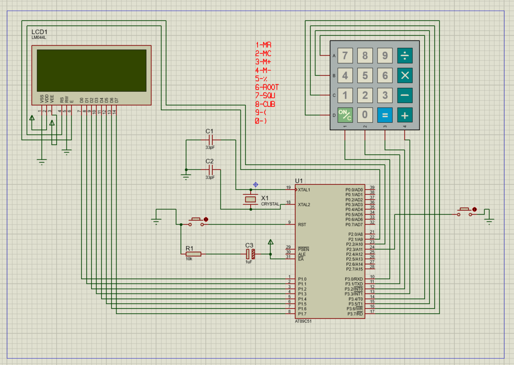

# 8051 Full-Featured Calculator

> A complete expression calculator built in pure 8051 Assembly Language
> for the AT89C51 microcontroller. Supports operator precedence, brackets,
> signed 24-bit arithmetic, memory register, and special math functions.



---

## 📋 Project Overview

This project implements a **full expression calculator** from scratch in
8051 Assembly (MIDE-51). Unlike simple left-to-right calculators, this one
correctly evaluates expressions like `3 + 4 * 2 = 11` respecting operator
precedence — using Dijkstra's Shunting-Yard algorithm implemented entirely
in assembly.

## ✨ Features

- ✅ Operator precedence (`*` `/` before `+` `-`)
- ✅ Bracket support with implicit multiplication (`3(4+5)` → 27)
- ✅ 24-bit signed arithmetic (range: ±8,388,607)
- ✅ Decimal division (7÷2 = 3.5)
- ✅ Memory register — M+, M−, MR, MC
- ✅ Special functions — x², x³, √ (via MODE layer)
- ✅ Percentage operator `%`
- ✅ Unary minus (e.g. `-5 * 3 = -15`)
- ✅ 4 error states — DIV/0, Overflow, 3-digit limit, Bracket mismatch

## 🛠️ Hardware

| Component       | Part              | Connection        |
|-----------------|-------------------|-------------------|
| Microcontroller | AT89C51 (8051)    | U1 — 12MHz crystal|
| Display         | LM044L 20×4 LCD   | Data: P1, RS: P2.1, EN: P2.2 |
| Keypad          | 4×4 Matrix        | P3.0–P3.7         |
| MODE Button     | Tactile Switch    | P2.3 (active LOW) |
| M−, MR, MC      | Tactile Switches  | P2.4–P2.6         |
| Crystal         | 12 MHz + 33pF ×2  | XTAL1 / XTAL2     |
| Reset           | 10kΩ + 10µF       | RST (pin 9)       |

## ⌨️ Keypad Layout

```
[ 7 SQU ][ 8 CUB ][ 9  (  ][ ÷ ]
[ 4  M- ][ 5  %  ][ 6  √  ][ × ]
[ 1  MR ][ 2  MC ][ 3  M+ ][ - ]
[ ON/C  ][ 0  )  ][   =   ][ + ]
```

Small labels = function in MODE layer. Press MODE first, then the key.

## 🗂️ Project Structure

```
8051-calculator/
├── src/
│   ├── calculator.asm        # Full source (1485 lines)
├── simulation/
│   └── calculator.pdsprj     # Proteus 8 project file
├── hex/
│   └── calculator.hex        # Compiled Intel HEX output
└── docs/
    ├── circuit.png           # Schematic screenshot
    ├── ram-map.md            # RAM layout documentation
    └── how-it-works.md       # Algorithm explanation
```

## 🚀 How to Run

### Simulate in Proteus
1. Open `simulation/calculator.pdsprj` in Proteus 8
2. Load `hex/calculator.hex` into the AT89C51 component
3. Click Play ▶ and use the virtual keypad

### Assemble from source
1. Open `src/calculator.asm` in MIDE-51
2. Press F9 (Build) to assemble
3. The `.hex` file is generated in the same folder

## 📐 How It Works

The calculator uses the **Shunting-Yard algorithm** to evaluate expressions
with correct precedence. Two stacks are maintained in internal RAM:

- **Value Stack** (40H–5DH) — stores 24-bit operands (10 deep)
- **Operator Stack** (5EH–67H) — stores operator characters (10 deep)

When an operator is pressed, its precedence is compared to the top of the
operator stack. Higher-precedence operators are applied first.

See [`docs/how-it-works.md`](docs/how-it-works.md) for full details.

## ⚠️ Error Handling

| Error Message    | Trigger                              |
|------------------|--------------------------------------|
| `ERROR: DIV BY 0`| Divisor is zero                      |
| `OVERFLOW!`      | Result exceeds ±8,388,607 or stack full |
| `ERR:3DIG`       | Typing a 4th digit (max input = 999) |
| `BRACKET ERR`    | Mismatched `(` `)` in expression     |

## 🧰 Tools Used

- **MIDE-51** — 8051 assembler and IDE
- **Proteus 8** — Circuit simulation

## 📄 License

MIT License — see [LICENSE](LICENSE) for details.
